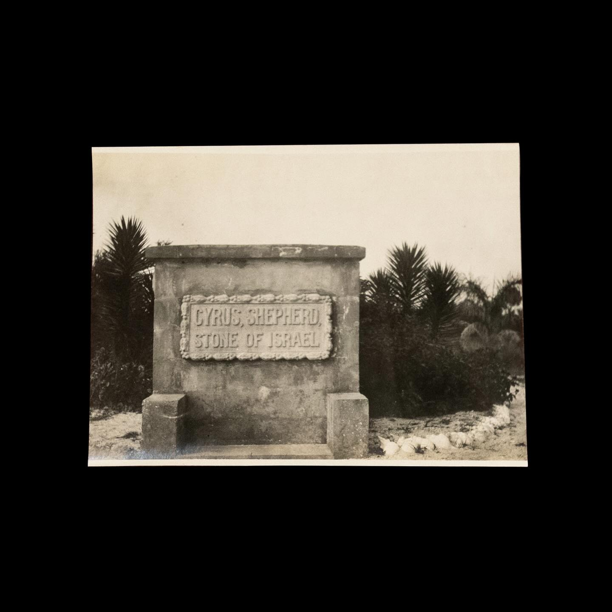
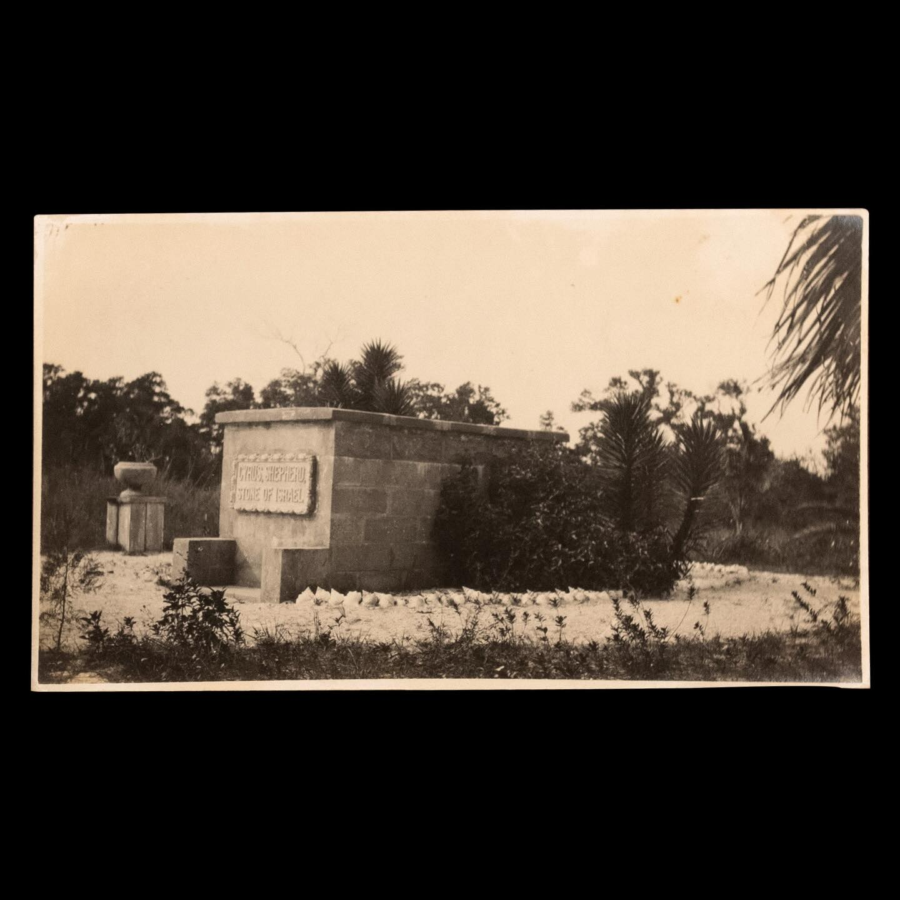

Cyrus Teed was laid to rest today, December 27, 1908

“In compliance with the law, and only for such reason, the body of Cyrus R. Teed i placed in this stone vault. 
We the disciples of Koresh, Shepherd, Stone of Israel, Know that this sepulcher cannot hold his body, for he will overcome death, and in his immortal body will rise triumphant from the tomb; And thus shall be fulfilled the saying: 
“O grave where is thy victory, 
O death where is thy sting?”

Written by Anastasia, 
A testimony of faith and sealed
Placed in one corner of the wall of Master’s stone
(Ark of the Convenant)
Sister Lydia”

(L to R: Virginia Andrews, Christine Hamilton, Esther Stotler (standing), Evelyn Bubbett (seated), K.U. president James H. Bubbett, Elizabeth Robinson, Etta Silverfriend, George W. Hunt, Bertha Boomer.) 

Courtesy of @floridamemory & Florida State Archives

