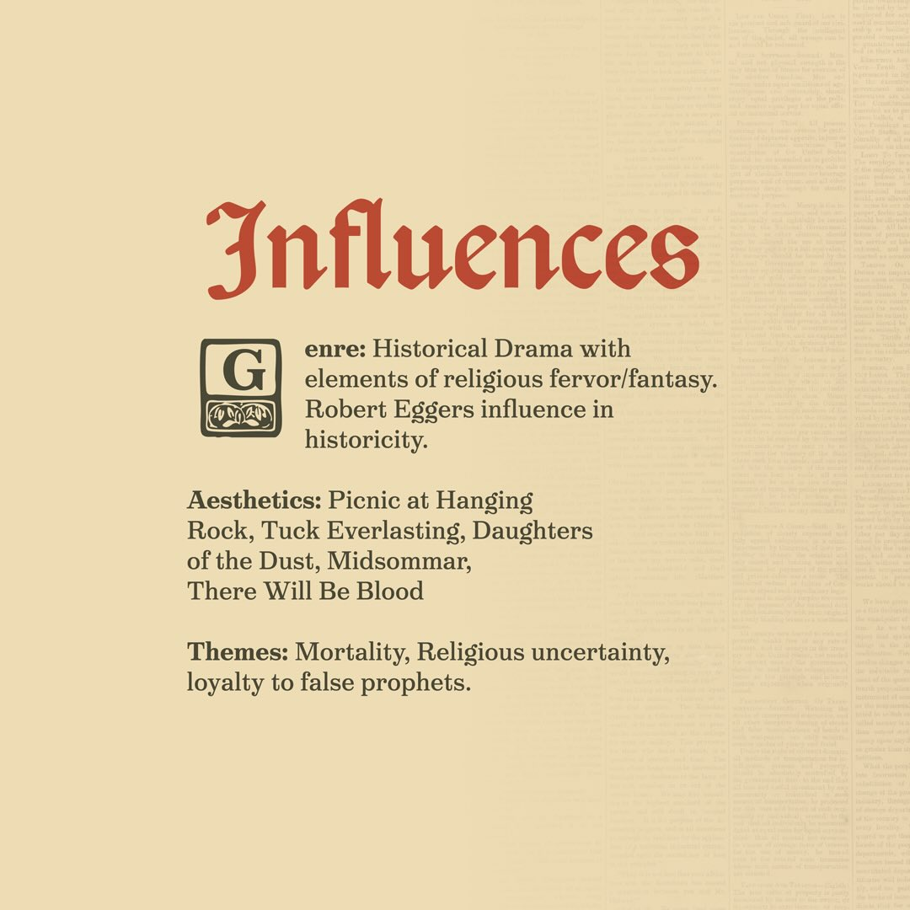
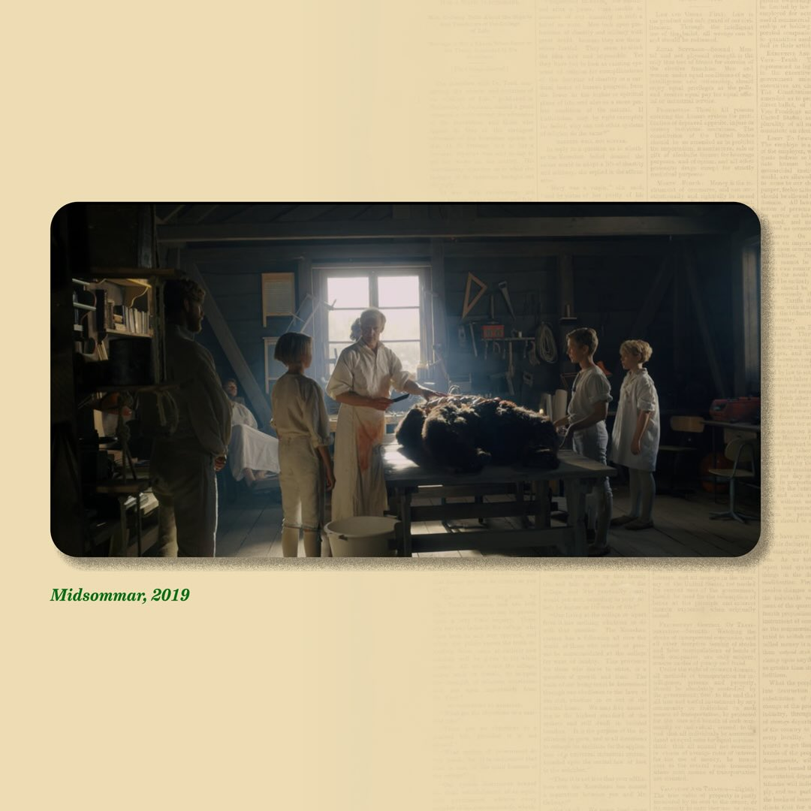
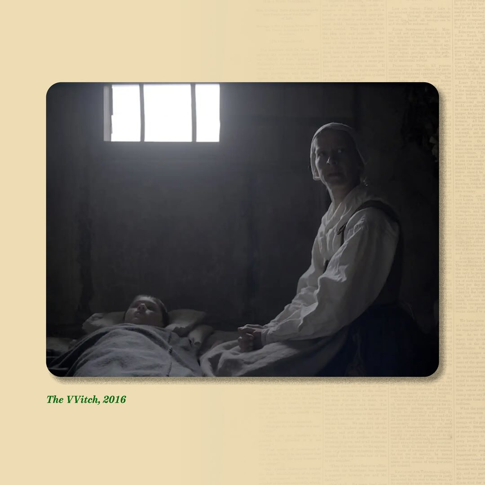

Last Days of Koreshan takes influence from a variety of directors such as Ari Aster (Midsommar), Michael Haneke (The White Ribbon), Robert Eggers (The VVitch), Peter Weir (Picnic at Hanging Rock), PT Anderson (There Will Be Blood) and, among other films while being cut from the cloth of real Florida History.

